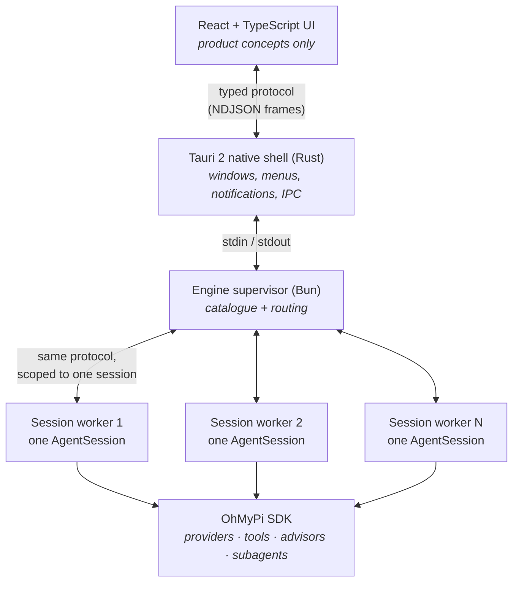

# Architecture

The Orchestrator is a desktop **host** for OhMyPi. It contains no model clients, no tool
implementations, no session format, and no advisor engine of its own. Those are OMP's, and the
whole design exists to expose them well.

## Layers



### Responsibilities

| Layer | Owns | Must not |
|---|---|---|
| **UI** (`apps/desktop/src`) | Product concepts: projects, sessions, transcript, usage | Know OMP internals |
| **Tauri** (`src-tauri`) | Desktop lifecycle, sidecar supervision, menus, notifications, IPC boundary | Contain product logic |
| **Protocol** (`packages/protocol`) | Typed, versioned messages; redaction | Depend on OMP |
| **Engine** (`packages/engine`) | Session lifetimes, routing, catalogue | Reimplement agent behaviour |
| **Adapter** (`packages/omp-adapter`) | All upstream-specific integration | Leak upstream types upward |
| **Usage** (`packages/usage`) | Normalised attribution and de-duplication | Invent numbers |

The adapter is the seam that made the architecture pivot below a contained change rather than a
rewrite.

## Why process-per-session

The preferred design was many `AgentSession`s in one process, isolated by a private `AgentRegistry`
— and that is what upstream's SDK docs suggest for concurrent embedders.

An initial implementation of that **passed** a concurrency suite: two sessions streamed
simultaneously, executed real tools, and showed no cross-talk. But that suite ran in a narrow
envelope — no MCP, no LSP, no subagents. Inspecting upstream source revealed four hazards outside
that envelope which an embedder **cannot** fix from outside:

| Hazard | Effect |
|---|---|
| `buildSubagentSessionOptions` never threads `agentRegistry` | Every subagent registers into `AgentRegistry.global()`, so session A's subagents become visible to session B. A private registry does not prevent this. |
| `AsyncJobManager` is a process singleton built only for the first session | Sessions 2..N silently lose `bash --async` and parallel `task` |
| `AgentLifecycleManager.global().dispose()` runs on any main-kind dispose | Closing one session releases other sessions' parked subagents |
| `Settings.init()` is memoized and ignores later callers' `cwd`/`agentDir` | Per-session settings silently collapse onto the first session's |

Upstream's own multi-session embedder (`typescript-edit-benchmark`) works only by disabling
essentially everything: no MCP, no LSP, no extensions, no skills, three tools. The Orchestrator
needs strictly more.

**Decision:** one worker process per top-level session. Every process's session is therefore
"first", every process-global is private to one session, and a fatal error contains to one session
instead of the whole app. The product requirement outranked the preferred diagram.

The frontend cannot tell which topology is in use — the supervisor speaks the same protocol either
way, and the concurrency tests assert against the supervisor's public API rather than the topology.

### Costs accepted

- Roughly 300–470 MB RSS per live worker, depending on load. See
  [PERFORMANCE.md](./PERFORMANCE.md) for the full measured breakdown, including how RSS scales
  across concurrent workers.
- MCP servers and LSP pools are per-session rather than shared: each worker starts its own, so N
  sessions in the same project each pay their own connection cost rather than sharing one pool.
  MCP is enabled per worker in normal operation and disabled only in test mode
  (`ORCHESTRATOR_TEST_MODE=1`) — there is no per-session UI toggle for it.

## Concurrency model

```
visibleSessionId !== runningSessionIds     // a normal, supported state
```

Selecting a session in the sidebar is a pure UI change. It never pauses, disposes, or aborts
anything: session lifetime is tied to a worker process, not to what React is rendering. React state
is a *view* of engine state, so unmounting a component can never kill an agent.

Per-session isolation guarantees, all covered by `packages/engine/test/concurrency.test.ts`:

- both sessions stream simultaneously
- both execute real tools
- events, transcripts, `cwd`, and usage never cross
- aborting one leaves the others running
- disposing one leaves the others running

## Protocol

Newline-delimited JSON over stdio, versioned and negotiated on connect.

```ts
EngineRequest  { protocolVersion, requestId, type, payload }
EngineResponse { protocolVersion, requestId, ok, result | error }
EngineEventFrame { protocolVersion, sequence, sessionId?, event }
```

Rules the implementation enforces:

- **stdout carries protocol frames only.** `console.*` is rebound to stderr at startup, so a stray
  log from any dependency cannot desynchronise the decoder.
- **Monotonic `sequence`** lets the host detect dropped frames after a crash. This is wired end to
  end: on a detected gap the UI calls `session.transcript` to refetch the worker's bounded
  (20,000-event) history and reconcile, rather than silently rendering a hole.
- **Malformed frames are reported, never fatal.**
- **Everything outbound is redacted** (`packages/protocol/src/redact.ts`).
- **Text and reasoning deltas are coalesced** at ~30 fps so streaming stays live without flooding
  React.

## Data flow: one turn

```mermaid
sequenceDiagram
  participant U as UI
  participant T as Tauri
  participant S as Supervisor
  participant W as Worker
  participant O as OMP

  U->>T: session.prompt
  T->>S: NDJSON frame
  S->>W: routed by sessionId
  W->>O: session.prompt(text, {streamingBehavior})
  Note over W,O: returns immediately;<br/>the turn runs in the background
  O-->>W: message_update / tool_execution_* / turn_end
  W-->>S: normalised product events
  S-->>T: forwarded verbatim
  T-->>U: engine://frame
  Note over U: user may switch sessions freely;<br/>this turn keeps running
```

## Persistence

OMP owns transcripts. The Orchestrator does not create a competing format.

- Sessions live where OMP puts them: `~/.omp/agent/sessions/<encoded-cwd>/<timestamp>_<id>.jsonl`.
- `SessionManager.listAll()` discovers sessions across every project for the sidebar.
- Orchestrator-only UI metadata belongs in
  `~/Library/Application Support/The Orchestrator/`, never mixed into OMP's directories.

**Single-writer enforcement.** OMP session files have no cross-process lock, and two writers lose
data silently. The supervisor tracks which persisted path each worker owns and refuses to open the
same session twice, surfacing a clear message instead of risking corruption.

## Crash recovery

The Rust supervisor reaps the engine process and reports exit explicitly.

1. The engine's exit is detected (polling `try_wait`, so a wedged process can still be killed).
2. Every session is marked **interrupted** — an in-flight model request is never reported as still
   running once its process is gone.
3. Transcripts already in the UI are preserved.
4. "Restart engine" relaunches; persisted OMP sessions are rediscovered and can be resumed.

The same path handles a single worker dying: only that session is interrupted, and the rest keep
running. That containment is a direct benefit of process-per-session.

## Security boundary

- The webview has a restrictive CSP and a narrow Tauri capability set; it cannot touch the
  filesystem or spawn processes.
- Credentials never leave the engine. The frontend receives sanitised metadata only.
- Redaction is applied at the protocol boundary and in the logger, so secrets reach neither the UI
  nor the log files.
- Shell and filesystem access is OMP's, with OMP's approval semantics — the absence of a terminal
  UI is never treated as consent.

See [SECURITY.md](./SECURITY.md).
