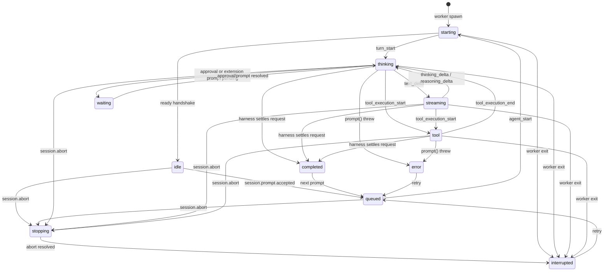

# Session model

This document defines what "a session" means in The Orchestrator, because the word covers
seven different things that have different lifetimes and different owners. Getting them
confused is the source of most incorrect assumptions about the product ("switching tabs
stopped my agent", "closing the window lost my work", "two windows can edit one transcript").

Related reading: [ARCHITECTURE.md](./ARCHITECTURE.md) for process topology,
[OMP_COMPATIBILITY.md](./OMP_COMPATIBILITY.md) for the upstream constraints that shaped it,
[USAGE_MODEL.md](./USAGE_MODEL.md) for how usage is attributed across these identities.

## 1. Seven distinct identities

| Identity | Owner | Lifetime | Type |
| --- | --- | --- | --- |
| Orchestrator session id | supervisor | one worker process | `randomUUID()` string |
| OMP session id / path | OMP `SessionManager` | the file on disk | id string + absolute `.jsonl` path |
| Active runtime | supervisor | from spawn to worker exit | a `Worker` (an OS process) |
| Visible UI session | React store | a render | `visibleSessionId?: string` |
| Persisted session | the filesystem | until the user deletes it | `DiscoveredSession` |
| User request / task id | harness finalizer | persisted request, including revisions | `TaskSnapshot.requestId` / `EventBase.userTurnId` |
| Execution turn id | worker | one primary execution attempt | `EventBase.turnId` |

### Orchestrator session id

Assigned in `WorkerSupervisor.create` (`packages/engine/src/worker/supervisor.ts`) with
`randomUUID()`, before the worker process is spawned. It is the address used by every
host request and every event: the Tauri host and the frontend only ever say
"session `<uuid>`", and the supervisor routes that to the owning worker. It is not written
into the OMP transcript and does not survive a restart of the app.

There is exactly one Orchestrator session id per worker process, and exactly one
`AgentSession` per worker process. That equality is the whole point of the design (see
`packages/engine/src/worker/main.ts` for the four upstream hazards that forced it).

### OMP session id and path

Owned by OMP, not by this app. The worker either creates a session:

```ts
OMP.SessionManager.create(
  boot.projectPath,
  OMP.SessionManager.getDefaultSessionDir(boot.projectPath, boot.agentDir),
)
```

or opens an existing one with `OMP.SessionManager.open(boot.resumeSessionPath)`.

Once the `AgentSession` exists, the worker reads `session.sessionFile` and
`session.sessionId` and emits `session.persisted`:

```ts
emit({
  type: "session.persisted",
  sessionId: boot.sessionId,       // Orchestrator id
  ompSessionPath: String(sessionFile),
  ompSessionId: String(session.sessionId ?? ""),
});
```

`RuntimeManager` intercepts that event and calls `supervisor.noteSessionPersisted(...)`,
which stamps `ompSessionPath` / `ompSessionId` onto the worker's `SessionSummary`. Those two
fields identify the persisted counterpart of a live runtime.

### Active runtime

A worker process. `Worker` in `supervisor.ts` owns the `Bun.Subprocess`, an NDJSON frame
decoder over its stdout, a pending-request map keyed by `requestId`, and the `ready`/`exited`
flags. A session is "running" if and only if its worker process is alive. Nothing in the
React tree, and nothing about which window is focused, participates in that definition.

### Visible UI session

`visibleSessionId` in `apps/desktop/src/store.ts`. It is a pure selection — one string in a
Zustand store. `select(id)` sets it and clears that session's `unread` flag; it sends no
request to the engine at all:

```ts
select: (id) => set((s) => { /* visibleSessionId + unread:false, nothing else */ }),
```

### Persisted session

The `.jsonl` file. `sessions.discover` returns `DiscoveredSession[]` from OMP's own
`SessionManager.list(cwd)` / `listAll()`, then `RuntimeManager.discoverSessions` marks
`openInThisApp` by intersecting with `supervisor.openSessionPaths()`. A persisted session
exists whether or not this app is running.

## 2. On-disk layout

Sessions live under OMP's agent directory (`~/.omp/agent` unless overridden — the app reads
it via `getAgentDir()`, it never hardcodes it):

```
~/.omp/agent/sessions/<encoded-cwd>/<timestamp>_<uuid>.jsonl
```

- `<encoded-cwd>` encodes the actual tool checkout. Isolated worktrees have separate directories;
  discovery maps them back to their logical project for grouping.
- `<timestamp>_<uuid>` makes filenames sort chronologically and stay unique.
- The file is JSON Lines: one appended record per event. It is append-oriented, which is
  exactly why concurrent writers are dangerous (see §5).

Task snapshots, staged answers, and immutable reviewer-round ownership use OMP custom entries.
Only a persisted task's `answer.messageId` commits a staged answer. There is no mirrored transcript.
App-only preferences, sourced project decisions, and managed worktree metadata live under
Application Support; decisions are never automatically injected into model context.

## 3. Run state machine

`RUN_STATES` in `packages/protocol/src/domain.ts`:

```
idle, queued, starting, thinking, streaming, tool, waiting, stopping,
completed, interrupted, error, hibernated
```

The active states — the ones in which the engine is doing work — are
`queued`, `starting`, `thinking`, `streaming`, `tool`, `waiting`, `stopping`.
`idle`, `completed`, `interrupted`, `error` and `hibernated` are inactive execution states.
They are not publication claims: task phases and unfinished queued requests are tracked separately.
The transcript, inbox, unread completion state and notifications use explicit task snapshots.



Where each transition comes from:

- `starting`, `thinking`, `streaming`, `tool`, and `idle` are mapped from upstream activity.
  A raw `agent_end` does not publish an answer. The worker owns the final execution outcome.
- `queued` and `stopping` are set by the worker's command loop when it accepts a prompt or
  begins an abort.
- `interrupted` is set by the abort path, or by the supervisor when a worker process dies.
- `waiting` is emitted whenever a prompt is pending against the session: an upstream
  `ClientBridge.requestPermission` approval, or an extension UI request (select/confirm/input/
  editor/notify). It clears back to `thinking` when the prompt resolves — via `approval.respond`,
  `extension.ui.respond`, or an abort, which cancels any prompt pending on that session rather than
  leaving it stuck in `waiting` forever.

### Task finalization and publication

Each accepted new prompt gets a durable request id. A queued prompt creates a different request;
steering updates the current request's explicit intent. Execution turn ids can change across
revisions without changing which user request owns the answer.

`TaskSnapshot.phase` is `working`, `reviewing`, `revising`, `finalizing`, `complete`,
`blocked`, `interrupted`, or `error`. The primary calls the essential `submit_answer` tool with
the request id, complete user-facing text, and finding dispositions. Ordinary assistant messages
remain progress or drafts. There is no last-message fallback if the primary omits submission.

Before publication, the harness settles request-owned finite jobs, subagents and result delivery.
Long-running managed servers are not completion gates. Each candidate receives a fresh SDK
reviewer roster with durable source-name ownership for its exact request and revision; old
callbacks cannot attach their findings to a newer request. Review requires a true
`waitForAdvisorCatchup` result and healthy reviewers that actually yielded. False, timeout,
or unavailable review becomes `blocked` with an incomplete-review explanation.

The primary, not the reviewer or harness, adjudicates non-nit findings with revision-specific
`accepted`, `rejected`, or `unresolved` dispositions and concrete rationales. The harness anchors
revision instructions to the original request and explicit intent updates. Automatic convergence
is bounded to three submitted revisions; unresolved findings stop publication. Explicit retry
starts a fresh bounded attempt rather than silently rerunning the user's original prompt.

Publication persists the canonical answer before emitting `task.updated`. Later progress and
review findings cannot replace or unpublish it. Late findings remain visible follow-up information.
Replay restores the same answer identity and exact source entry id. Legacy transcripts remain
readable without being retroactively labeled as reviewed publications.

### Stop and recovery

Stop fences publication, clears host and SDK prompt queues, cancels owned finite jobs and reviewer
work, and aborts with the SDK's user-interrupt reason. It cannot be undone by a late review result.
The worker's request runner and explicit review-retry path own `session.finished`; raw SDK
`agent_end` cannot convert an interrupted request into a completed one.

`session.finished` describes execution settlement, not answer publication. On a process boundary,
unfinished task snapshots become interrupted. Restoring a remembered session opens its durable
history in a fresh worker without resending any prompt. Retry review and newly submitted user
messages are explicit actions.

### Verification evidence

Live command and browser observations are attached to their owning request. The answer remains
primary; changed files and checks/activity are collapsed by default. Failed-run counts and incomplete
coverage remain visible. Expanding activity shows eight recent runs, with access to all records,
individual output, artifacts, and coverage detail.

The pinned SDK omits exit zero for completed synchronous bash results; the collector recognizes
that documented result shape, but never infers success from prose or generic invocation success.
Timeouts, background jobs, and errors cannot pass. Exit zero does not prove tests ran, and browser
activity without structured assertions remains an observation.

Workspace coverage uses versioned metadata change tokens rather than content hashes. Capture is
synchronous at tool-event boundaries to avoid assigning late baselines to fast commands, and uses
two bounded metadata passes (10,000 files, one-second deadline). This briefly pauses worker event
delivery; filesystem calls can exceed the deadline before returning. Ignored files, submodule
contents, external/browser state, and changes preserving all observed metadata are not covered.
True concurrent tool execution and unstable capture remain uncovered. Later workspace edits stale
earlier evidence. Old content-hash fingerprints cannot establish coverage under the new scheme.
**Check coverage** compares metadata without rerunning commands or browser checks.


## 4. Concurrent execution

**Switching the visible session does not stop execution.** This is a design guarantee, not an
accident, and it holds because of three separate facts:

1. **Session lifetime is bound to a worker process.** The agent runs inside a `Bun.Subprocess`
   spawned by the supervisor. Its lifetime ends when that process exits — on
   `worker.shutdown`, on `sessions.close` with `dispose: true`, or on a crash. No UI event is
   in that list.

2. **React state is only a view.** From the header of `apps/desktop/src/store.ts`:

   > React state is a VIEW of engine state, never the runtime itself. Unmounting a session's
   > components must not stop its agent.

   Transcripts are stored in `sessions: Record<string, SessionView>` keyed by session id and
   updated by `apply(e)` for *every* incoming event, regardless of `visibleSessionId`. A
   background session's transcript, usage, context and advisor states keep accumulating while
   you look at something else.

3. **Prompts are acknowledged, not awaited.** The worker owns a serial queue of durable user
   requests and returns `{ accepted: true, mode }` immediately. The host is never blocked on a
   running request, and queued requests retain workspace ownership across intermediate finishes.

Therefore `visibleSessionId !== <the set of session ids in an active run state>` is a normal,
fully supported state. Several sessions may be in `thinking`/`tool`/`streaming` at once, each
in its own process, while the user watches a fourth. `activeCount()` counts them; the sidebar
shows per-session state for all of them.

The only visible-session-dependent behaviour is presentation:

- `select(id)` clears `unread` for that session.
- A newly published `task.updated` answer sets the session's unread completion state.
- `App.tsx` raises a completion notification for a new background publication; raw run completion
  or a merely closed advisor window is insufficient.

None of these touch the engine.

### Code workspaces and scoped shipping

New Git sessions default to isolated worktrees rooted at committed `HEAD`, with unique branches.
The logical project and actual checkout are distinct protocol fields. No uncommitted files,
dependencies, or secrets are copied. Shared mode remains explicit. Resume trusts the persisted
checkout; a fork shares that checkout rather than pretending to provide new file isolation.

Managed worktrees survive session closure and are not automatically deleted. Shipping commits
selected complete files, not selected hunks, through a temporary index while retaining unrelated
staged entries. Repositories with active commit hooks or mandatory signing must commit in a
terminal; the app refuses to bypass those policies. Integration requires clean source and target
trees and performs conflict preflight. Workspace locks include all unfinished queued tasks and
both roots involved in integration; they do not coordinate external Git/CLI writers.

## 5. Single-writer enforcement

OMP session `.jsonl` files have **no cross-process lock**. Two processes appending to the same
file will interleave records and silently lose data — there is no error, no detection, and the
transcript is corrupt afterwards. The Orchestrator therefore enforces the invariant itself, at
the only place that can see all runtimes: the supervisor, at create time.

```ts
if (config.resumeSessionPath) {
  for (const w of this.#workers.values()) {
    if (w.summary.ompSessionPath === config.resumeSessionPath) {
      throw Object.assign(new Error("That session is already open in The Orchestrator."), {
        kind: "session-corruption",
      });
    }
  }
}
```

The check runs before the worker is spawned, so the second writer never opens the file at all.
`ompSessionPath` is populated from the `session.persisted` event of each live worker, which is
why the comparison is against a path this app observed rather than one it predicted.

The UI reinforces this rather than relying on the error: `DiscoveredSession.openInThisApp` is
set by intersecting the discovery listing with `supervisor.openSessionPaths()`, so an
already-open session is shown as open instead of offered for a second resume.

Scope of the guarantee: it covers this app's own workers. It cannot stop a separate `omp` CLI
process, or a second copy of The Orchestrator, from opening the same file — no cross-process
lock exists to build on. Do not run the CLI on a session this app currently has open.

## 6. Resume, interoperability, and fork

**Resume.** `SessionLaunchConfig.resumeSessionPath` names an existing `.jsonl`. The worker
opens it with `SessionManager.open(path)` instead of creating a new one; everything
downstream — model resolution, advisors, event mapping — is identical. Resume is the
mechanism behind reopening a session after quitting the app: the Orchestrator session id is
new (new process), the OMP session id and path are the old ones.

The sidebar surfaces this directly: `sessions.discover` lists persisted sessions under a
"Previous sessions" section, and opening one starts a new worker with `resumeSessionPath` set.
On boot, that worker seeds a **transcript replay** from `SessionManager.getBranch()` so the
prior conversation renders immediately rather than starting blank. `session.transcript` also
serves the worker's bounded (20,000-event) history on demand, which the UI uses both for reload
and to reconcile a detected sequence gap (see [ARCHITECTURE.md](./ARCHITECTURE.md)).

**Interoperability with the OMP CLI.** The Orchestrator and `omp` are two interfaces over one
environment. The app reads OMP's agent directory, credential store, model registry, settings,
advisor discovery (`discoverAdvisorConfigs`) and session store directly; it never creates a
competing store. Consequences:

- A session started in the CLI appears in this app's discovery list and can be resumed here.
- A session started here appears to `omp` and can be resumed there once this app has closed it.
- Provider credentials are shared. `providers.login` runs OMP's own OAuth flow
  (`AuthStorage.login`) and emits `engine.auth` lifecycle events carrying the browser URL for the
  host to open; the engine never sees the resulting secret, since OMP writes it straight into its
  own credential store. Manual-code OAuth flows are refused with an actionable message rather than
  attempted. `providers.logout` still intentionally refuses — disconnecting a provider requires
  running `omp logout` once in a terminal.
- Sequential handoff is supported. Simultaneous use of the same session file is not, for the
  reason in §5.

**Fork.** `session.fork` uses upstream `SessionManager.forkFrom(sourcePath, cwd, sessionDir)`,
which copies the source session's entries and artifacts into a new file, stamps a
`parentSession` header recording the lineage, and writes the fork atomically before returning.
The source session is only ever read, never mutated:

- Forking a **live** session (one this app currently has a worker for) reads from that worker's
  persisted file — the on-disk snapshot at fork time, not an in-memory transcript — so the fork
  reflects what has actually been written so far.
- Forking a **discovered** (not-currently-open) session reads the file directly.
- The new session is immediately runnable, including on a different model than the source.

The UI exposes Fork in the sidebar's per-session context menu, the menu bar, and the command
palette. `DiscoveredSession.parentSessionPath` carries the lineage back into the discovery
listing so a forked session's ancestry is visible there too.

## 7. Disposal ordering and crash recovery

### Ordered shutdown

Disposal runs outermost-first and never leaves an orphan:

1. `sessions.close` → `RuntimeManager.close(sessionId, dispose)` clears that session's records
   from the engine-wide usage index, then calls `supervisor.close`.
2. `supervisor.close` removes the worker from the routing map **before** shutting it down, so
   no request can be routed to a process that is on its way out.
3. `Worker.shutdown` sends a `worker.shutdown` request (8s timeout), then races
   `proc.exited` against a 5s timer and `kill()`s if the process has not gone.
4. Inside the worker, `worker.shutdown` replies `{ stopping: true }` first and does the real
   teardown in a `queueMicrotask` — `await session.dispose()` then `process.exit(0)` — so the
   supervisor always receives the acknowledgement before the pipe closes.
5. `WorkerSupervisor.shutdown()` snapshots the worker list, clears the map, and
   `Promise.allSettled`s every `shutdown()`, so one hung worker cannot block the rest.
6. If the stdin loop ends without a shutdown request (the supervisor died), the worker falls
   out of its read loop and still runs `await session.dispose().catch(() => {})` before exit.

`session.dispose()` is safe to call unconditionally here precisely because of the one-session-
per-process rule: upstream's `AgentLifecycleManager.global().dispose()` reaps across sessions,
but in this topology there are no other sessions in the process to reap.

### Crash recovery

Two layers, because two things can die.

**A worker dies.** `Worker`'s `proc.exited` handler rejects every in-flight request with "The
session engine exited unexpectedly." rather than leaving the host hanging, then calls
`supervisor.#onWorkerExit`, which:

```ts
w.summary.runState = "interrupted";        // never report a dead run as running
emit({ type: "session.failed", sessionId, error: { kind: "engine", retryable: true, ... } });
emit({ type: "session.finished", sessionId, runState: "interrupted" });
```

The user sees the failure in the transcript and the session settles in `interrupted`, not
`completed`. The `.jsonl` written up to the crash is intact — the error message says so
explicitly ("Its transcript is preserved").

The dead worker is also **removed from the routing map**, not left dangling — a crashed session
does not stay addressable. Its `SessionSummary` is kept so the sidebar can still show it, and any
further request against that session id fails with an actionable "resume" error rather than
hanging or silently no-op'ing, pointing the user at reopening the persisted file (§6). Worker
stderr is captured at `info` level into a bounded 40-line diagnostic ring that is surfaced
verbatim in the create/crash error, so "why did this session die" does not require digging through
log files. Every event a worker emits is ownership-checked against the session id it was spawned
for, so a worker cannot speak for a session it does not own.

**The whole engine dies.** `engine-client` reports a supervisor `exited` lifecycle event and
`App.tsx` responds by moving the engine to `offline` and calling:

```ts
st.markAllInterrupted(
  "The engine stopped. This session was interrupted; its transcript is preserved.",
);
```

`markAllInterrupted` rewrites every session's `runState` to `interrupted` and appends a system
transcript item with `tone: "error"`. The comment states the rule: never pretend an in-flight
request survived a dead process.

In both layers the fallback state is `interrupted`. No path in this codebase reports
`completed` for work that did not finish.
