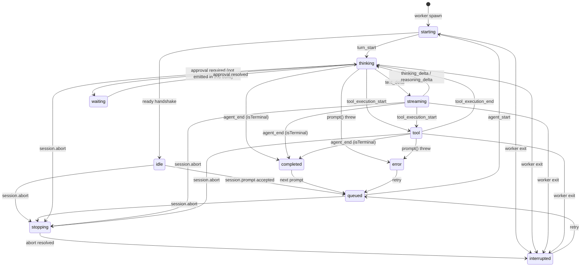

# Session model

This document defines what "a session" means in The Orchestrator, because the word covers
five different things that have different lifetimes and different owners. Getting them
confused is the source of most incorrect assumptions about the product ("switching tabs
stopped my agent", "closing the window lost my work", "two windows can edit one transcript").

Related reading: [ARCHITECTURE.md](./ARCHITECTURE.md) for process topology,
[OMP_COMPATIBILITY.md](./OMP_COMPATIBILITY.md) for the upstream constraints that shaped it,
[USAGE_MODEL.md](./USAGE_MODEL.md) for how usage is attributed across these identities.

## 1. Five distinct identities

| Identity | Owner | Lifetime | Type |
| --- | --- | --- | --- |
| Orchestrator session id | supervisor | one worker process | `randomUUID()` string |
| OMP session id / path | OMP `SessionManager` | the file on disk | id string + absolute `.jsonl` path |
| Active runtime | supervisor | from spawn to worker exit | a `Worker` (an OS process) |
| Visible UI session | React store | a render | `visibleSessionId?: string` |
| Persisted session | the filesystem | until the user deletes it | `DiscoveredSession` |

### Orchestrator session id

Assigned in `WorkerSupervisor.create` (`packages/engine/src/worker/supervisor.ts`) with
`randomUUID()`, before the worker process is spawned. It is the address used by every
host request and every event: the Tauri host and the frontend only ever say
"session `<uuid>`", and the supervisor routes that to the owning worker. It is not written
into the OMP transcript and does not survive a restart of the app.

There is exactly one Orchestrator session id per worker process, and exactly one
`AgentSession` per worker process. That equality is the whole point of the design (see
`packages/engine/src/worker/main.ts` for the four upstream hazards that forced it).

### OMP session id and path

Owned by OMP, not by this app. The worker either creates a session:

```ts
OMP.SessionManager.create(
  boot.projectPath,
  OMP.SessionManager.getDefaultSessionDir(boot.projectPath, boot.agentDir),
)
```

or opens an existing one with `OMP.SessionManager.open(boot.resumeSessionPath)`.

Once the `AgentSession` exists, the worker reads `session.sessionFile` and
`session.sessionId` and emits `session.persisted`:

```ts
emit({
  type: "session.persisted",
  sessionId: boot.sessionId,       // Orchestrator id
  ompSessionPath: String(sessionFile),
  ompSessionId: String(session.sessionId ?? ""),
});
```

`RuntimeManager` intercepts that event and calls `supervisor.noteSessionPersisted(...)`,
which stamps `ompSessionPath` / `ompSessionId` onto the worker's `SessionSummary`. Those two
fields are the only bridge between the app's identity space and OMP's.

### Active runtime

A worker process. `Worker` in `supervisor.ts` owns the `Bun.Subprocess`, an NDJSON frame
decoder over its stdout, a pending-request map keyed by `requestId`, and the `ready`/`exited`
flags. A session is "running" if and only if its worker process is alive. Nothing in the
React tree, and nothing about which window is focused, participates in that definition.

### Visible UI session

`visibleSessionId` in `apps/desktop/src/store.ts`. It is a pure selection — one string in a
Zustand store. `select(id)` sets it and clears that session's `unread` flag; it sends no
request to the engine at all:

```ts
select: (id) => set((s) => { /* visibleSessionId + unread:false, nothing else */ }),
```

### Persisted session

The `.jsonl` file. `sessions.discover` returns `DiscoveredSession[]` from OMP's own
`SessionManager.list(cwd)` / `listAll()`, then `RuntimeManager.discoverSessions` marks
`openInThisApp` by intersecting with `supervisor.openSessionPaths()`. A persisted session
exists whether or not this app is running.

## 2. On-disk layout

Sessions live under OMP's agent directory (`~/.omp/agent` unless overridden — the app reads
it via `getAgentDir()`, it never hardcodes it):

```
~/.omp/agent/sessions/<encoded-cwd>/<timestamp>_<uuid>.jsonl
```

- `<encoded-cwd>` is OMP's encoding of the project working directory, so all sessions for one
  project share a directory. This is why `SessionManager.list(projectPath)` is cheap.
- `<timestamp>_<uuid>` makes filenames sort chronologically and stay unique.
- The file is JSON Lines: one appended record per event. It is append-oriented, which is
  exactly why concurrent writers are dangerous (see §5).

The Orchestrator writes nothing of its own beside these files. There is no parallel database,
no sidecar index, no mirrored transcript. Everything the app knows about a past session is
read back out of OMP's store.

## 3. Run state machine

`RUN_STATES` in `packages/protocol/src/domain.ts`:

```
idle, queued, starting, thinking, streaming, tool, waiting, stopping,
completed, interrupted, error
```

`ACTIVE_RUN_STATES` — the states in which the engine is doing work — are
`queued`, `starting`, `thinking`, `streaming`, `tool`, `waiting`, `stopping`.
`idle`, `completed`, `interrupted` and `error` are inactive. `isActiveRunState(s)` is the
single predicate; the sidebar's spinner, the composer's busy affordance and
`WorkerSupervisor.activeCount()` all derive from the same list rather than re-deciding.



Where each transition comes from:

- `starting`, `thinking`, `streaming`, `tool`, `idle`, `completed` are inferred by
  `EventMapper` (`packages/omp-adapter/src/event-mapper.ts`) from upstream events
  (`agent_start`, `turn_start`, `text_delta`, `thinking_delta` / `reasoning_delta`,
  `tool_execution_start`, `tool_execution_end`, `turn_end`, `agent_end`).
- `queued` and `stopping` are set by the worker's command loop when it accepts a prompt or
  begins an abort.
- `interrupted` is set by the abort path, or by the supervisor when a worker process dies.
- `waiting` is defined in the protocol and handled by the UI, but nothing emits it in this
  build: the approval UI bridge is not implemented (`approval.respond` returns `{ ok: false }`).
  It is reserved, not live.

### Aborted turns must report `interrupted`, never `completed`

This needed care because **two** places could plausibly emit a terminal outcome, and the one
that sees the upstream event does not know the user's intent.

1. `EventMapper` sees `agent_end`. An aborted run reaches `agent_end` exactly like a
   successful one. So the mapper deliberately does *not* emit `session.finished`:

   > the mapper reports activity; the runtime reports fate.

   It only calls `onRunState("completed")` as an activity hint.

2. The worker's `session.prompt` handler is the sole emitter of `session.finished`. It
   computes the outcome itself:

   ```ts
   let outcome: "completed" | "interrupted" | "error" = "completed";
   try {
     await s.prompt(text, { streamingBehavior: behavior });
     // abort() RESOLVES the prompt rather than rejecting it, so trust the
     // run state the abort handler recorded.
     if (runState === "interrupted" || runState === "stopping") outcome = "interrupted";
   } catch (e) {
     outcome = /abort/i.test(msg) ? "interrupted" : "error";
   } finally {
     setRunState(outcome);
     emit({ type: "session.finished", sessionId, runState: outcome });
   }
   ```

   Note the subtlety in the comment: upstream `abort()` *resolves* the in-flight `prompt()`
   promise instead of rejecting it, so a naive `try/catch` would classify every abort as a
   clean completion.

3. As a second line of defence, `setRunState` refuses the walk-back:

   ```ts
   if ((runState === "stopping" || runState === "interrupted") && s === "completed") return;
   ```

   So even a late `agent_end`-derived `completed` arriving after the abort cannot overwrite
   the real outcome.

`session.finished` is emitted exactly once per turn, carrying the state that actually
occurred. The store's reducer trusts it and also sets `unread: !visible` from it.

## 4. Concurrent execution

**Switching the visible session does not stop execution.** This is a design guarantee, not an
accident, and it holds because of three separate facts:

1. **Session lifetime is bound to a worker process.** The agent runs inside a `Bun.Subprocess`
   spawned by the supervisor. Its lifetime ends when that process exits — on
   `worker.shutdown`, on `sessions.close` with `dispose: true`, or on a crash. No UI event is
   in that list.

2. **React state is only a view.** From the header of `apps/desktop/src/store.ts`:

   > React state is a VIEW of engine state, never the runtime itself. Unmounting a session's
   > components must not stop its agent.

   Transcripts are stored in `sessions: Record<string, SessionView>` keyed by session id and
   updated by `apply(e)` for *every* incoming event, regardless of `visibleSessionId`. A
   background session's transcript, usage, context and advisor states keep accumulating while
   you look at something else.

3. **Prompts are acknowledged, not awaited.** The worker starts the turn in a detached async
   IIFE and returns `{ accepted: true, mode }` immediately, precisely so "the user can switch
   sessions while this one keeps working". The host is never blocked on a running turn.

Therefore `visibleSessionId !== <the set of session ids in an active run state>` is a normal,
fully supported state. Several sessions may be in `thinking`/`tool`/`streaming` at once, each
in its own process, while the user watches a fourth. `activeCount()` counts them; the sidebar
shows per-session state for all of them.

The only visible-session-dependent behaviour is presentation:

- `select(id)` clears `unread` for that session.
- `session.finished` sets `unread: !visible`.
- `App.tsx` raises a native notification only when a **background** session completes, or when
  a background session's advisor raises a `blocker`.

None of these touch the engine.

## 5. Single-writer enforcement

OMP session `.jsonl` files have **no cross-process lock**. Two processes appending to the same
file will interleave records and silently lose data — there is no error, no detection, and the
transcript is corrupt afterwards. The Orchestrator therefore enforces the invariant itself, at
the only place that can see all runtimes: the supervisor, at create time.

```ts
if (config.resumeSessionPath) {
  for (const w of this.#workers.values()) {
    if (w.summary.ompSessionPath === config.resumeSessionPath) {
      throw Object.assign(new Error("That session is already open in The Orchestrator."), {
        kind: "session-corruption",
      });
    }
  }
}
```

The check runs before the worker is spawned, so the second writer never opens the file at all.
`ompSessionPath` is populated from the `session.persisted` event of each live worker, which is
why the comparison is against a path this app observed rather than one it predicted.

The UI reinforces this rather than relying on the error: `DiscoveredSession.openInThisApp` is
set by intersecting the discovery listing with `supervisor.openSessionPaths()`, so an
already-open session is shown as open instead of offered for a second resume.

Scope of the guarantee: it covers this app's own workers. It cannot stop a separate `omp` CLI
process, or a second copy of The Orchestrator, from opening the same file — no cross-process
lock exists to build on. Do not run the CLI on a session this app currently has open.

## 6. Resume, interoperability, and fork

**Resume.** `SessionLaunchConfig.resumeSessionPath` names an existing `.jsonl`. The worker
opens it with `SessionManager.open(path)` instead of creating a new one; everything
downstream — model resolution, advisors, event mapping — is identical. Resume is the
mechanism behind reopening a session after quitting the app: the Orchestrator session id is
new (new process), the OMP session id and path are the old ones.

**Interoperability with the OMP CLI.** The Orchestrator and `omp` are two interfaces over one
environment. The app reads OMP's agent directory, credential store, model registry, settings,
advisor discovery (`discoverAdvisorConfigs`) and session store directly; it never creates a
competing store. Consequences:

- A session started in the CLI appears in this app's discovery list and can be resumed here.
- A session started here appears to `omp` and can be resumed there once this app has closed it.
- Provider credentials are shared. GUI sign-in is not implemented — `providers.login` throws
  with an actionable message telling the user to run `omp` once to connect a provider.
- Sequential handoff is supported. Simultaneous use of the same session file is not, for the
  reason in §5.

**Fork is not implemented.** `SessionLaunchConfig.forkFromSessionPath` and
`DiscoveredSession.parentSessionPath` exist in the protocol, but the request handler is
explicit:

```ts
case "session.fork":
  throw Object.assign(new Error("Fork is not implemented in this build."), {
    kind: "configuration",
  });
```

There is no branch-a-transcript feature in this build. Nothing in the UI offers it.

## 7. Disposal ordering and crash recovery

### Ordered shutdown

Disposal runs outermost-first and never leaves an orphan:

1. `sessions.close` → `RuntimeManager.close(sessionId, dispose)` clears that session's records
   from the engine-wide usage index, then calls `supervisor.close`.
2. `supervisor.close` removes the worker from the routing map **before** shutting it down, so
   no request can be routed to a process that is on its way out.
3. `Worker.shutdown` sends a `worker.shutdown` request (8s timeout), then races
   `proc.exited` against a 5s timer and `kill()`s if the process has not gone.
4. Inside the worker, `worker.shutdown` replies `{ stopping: true }` first and does the real
   teardown in a `queueMicrotask` — `await session.dispose()` then `process.exit(0)` — so the
   supervisor always receives the acknowledgement before the pipe closes.
5. `WorkerSupervisor.shutdown()` snapshots the worker list, clears the map, and
   `Promise.allSettled`s every `shutdown()`, so one hung worker cannot block the rest.
6. If the stdin loop ends without a shutdown request (the supervisor died), the worker falls
   out of its read loop and still runs `await session.dispose().catch(() => {})` before exit.

`session.dispose()` is safe to call unconditionally here precisely because of the one-session-
per-process rule: upstream's `AgentLifecycleManager.global().dispose()` reaps across sessions,
but in this topology there are no other sessions in the process to reap.

### Crash recovery

Two layers, because two things can die.

**A worker dies.** `Worker`'s `proc.exited` handler rejects every in-flight request with "The
session engine exited unexpectedly." rather than leaving the host hanging, then calls
`supervisor.#onWorkerExit`, which:

```ts
w.summary.runState = "interrupted";        // never report a dead run as running
emit({ type: "session.failed", sessionId, error: { kind: "engine", retryable: true, ... } });
emit({ type: "session.finished", sessionId, runState: "interrupted" });
```

The user sees the failure in the transcript and the session settles in `interrupted`, not
`completed`. The `.jsonl` written up to the crash is intact — the error message says so
explicitly ("Its transcript is preserved").

**The whole engine dies.** `engine-client` reports a supervisor `exited` lifecycle event and
`App.tsx` responds by moving the engine to `offline` and calling:

```ts
st.markAllInterrupted(
  "The engine stopped. This session was interrupted; its transcript is preserved.",
);
```

`markAllInterrupted` rewrites every session's `runState` to `interrupted` and appends a system
transcript item with `tone: "error"`. The comment states the rule: never pretend an in-flight
request survived a dead process.

In both layers the fallback state is `interrupted`. No path in this codebase reports
`completed` for work that did not finish.
